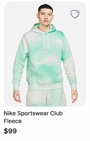
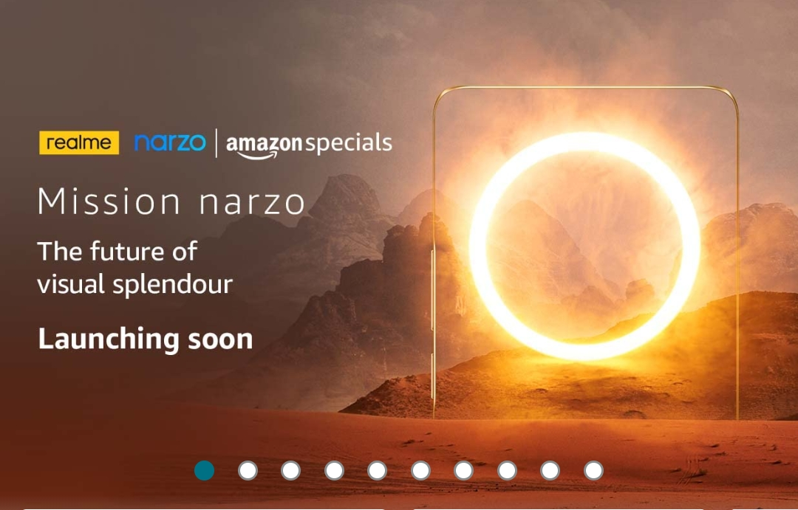
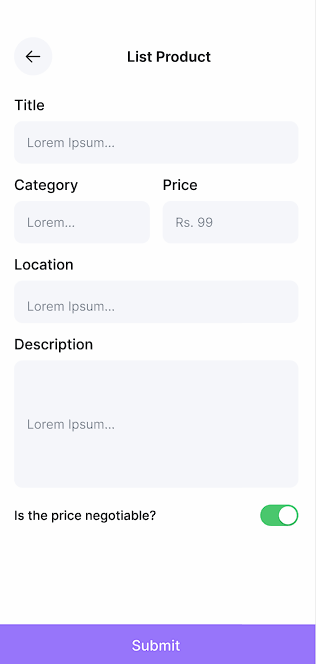

# DevClub Summer of Code 2023

## App Development: Week 2 

Here are the tasks for week 2 —

1. **Product Tile** Try to build the ProductTile as shown below. ProductTile represents a single product listing in our e-commerce marketplace. The ProductTile should display relevant information about the product, such as the product image, title, price, and a favorite button. Utilize the concepts of custom widget. 

    

2. **Promoted Product Banners** Implement a dynamic banner display to showcase promoted products or special offers in our e-commerce app. The banner display should enable users to swipe between different banners with smooth transitions. Use the concepts of Pageview widget for building banners.

    

3. **Post Products** Design and implement a form for users to post products for sale in our e-commerce marketplace. The form should collect necessary details about the product such as title, description, price, location, category, isNegotiable.

    

Continue with the project you initialized as `app/my-app` in week 1
