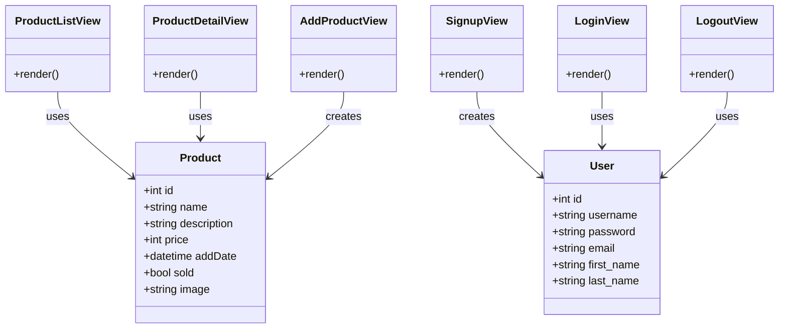

# Schema

### Product model

|Field      |Type         |Description                             |
|-----------|-------------|----------------------------------------|
|id         |Integer      |Primary Key                             |
|name       |CharField    |Product name                            |
|description|CharField    |Product description                     |
|price      |Integer      |Product price                           |
|addDate    |DateTimeField|Date and time when the product was added|
|sold       |BooleanField |Indicates if the product is sold or not |
|image      |ImageField   |Product image                           |

### User model

|Field      |Type         |Description                             |
|-----------|-------------|----------------------------------------|
|id         |Integer      |Primary Key                             |
|username   |CharField    |User's username                         |
|password   |CharField    |User's hashed password                  |

# Mermaid diagram

