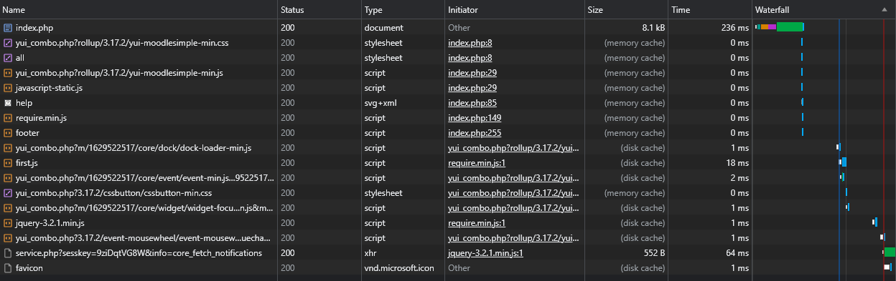
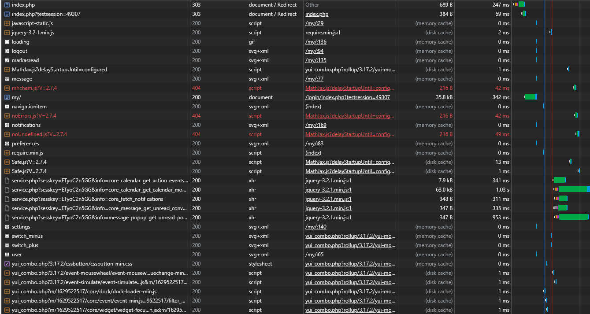
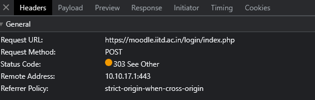
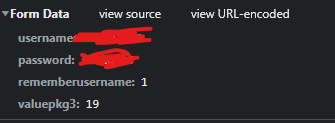
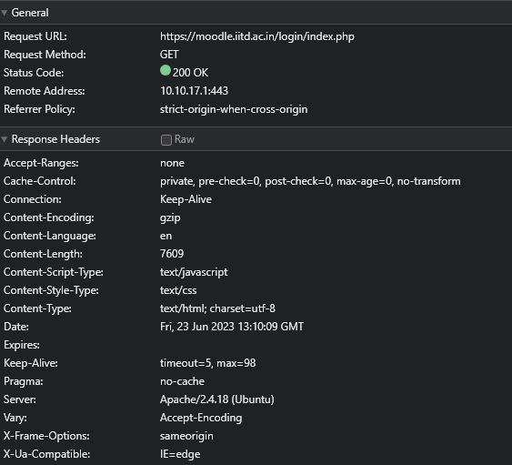
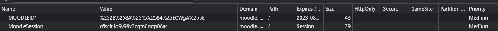

# Moodle: Network Report

## Requests made

When moodle is opened first:

First, index.php is requested. This is the webpage (PHP is a backend language like JS). Then, in order to display other assets, the index.php requests css files (for styling) as well as JavaScript files for subroutines. The favicon is hosted on an external site, and loaded last.

After logging in:

There's a lot of requests! The most interesting one is the topmost one: it's a POST request and the payload contains the username and password which is obviously verified server-side. The response is a redirect, code 303, as the verification succeeds and it redirects to the dashboard. **Interestingly, the captcha is just text-based and easily bypassable by a simple script!**

The POST request:

The payload:

## What do the headers mean?

Here are the response headers for the initial login page request:

Here's the headers listed and what they mean:

    HTTP/1.1 200 OK								# Response code (200 is OK)
    Date: Fri, 23 Jun 2023 13:10:09 GMT 		# Date and time of response
    Server: Apache/2.4.18 (Ubuntu) 				# The server. They're using Apache to serve the webpage on Ubuntu (other softwares are nginx, lighttpd)
    Expires: 									# Time/date at which content expires. No expiry date here.
    Cache-Control: private, pre-check=0, post-check=0, max-age=0, no-transform 		# Rules for the browser on how to cache this page
    Pragma: no-cache 							# I don't get why theyre using a deprecated feature. Modern pages use Cache-Control for this. no-cache just says the browser must always submit a request and not cache the page.
    Content-Language: en 						# Language of content
    Content-Script-Type: text/javascript		# Content language, it's JS here.
    Content-Style-Type: text/css 				# Content style language, it's CSS here.
    X-UA-Compatible: IE=edge 					# Optional, unofficial header for IE browsers showing compatibility. edge is the highest compatibility mode.
    Accept-Ranges: none 						# Describes support for partial downloads
    X-Frame-Options: sameorigin 				# Describes whether this page is allowed to be embedded in other sites. In this case it can only be embedded in other places on the same root domain.
    Vary: Accept-Encoding 						# Allows the cache to cache and serve up different versions of the page depending on if the browser wants different encoding or compression (gzip)
    Content-Encoding: gzip 						# Compression of the content just to decrease request size
    Content-Length: 7609 						# Size of content in bytes
    Keep-Alive: timeout=5, max=98 				# Gives the browser the time (5seconds) that the server will tolerate an idle connection before closing it. A max of 98 parallel requests can be sent, the server will close any extra ones after.
    Connection: Keep-Alive 						# Allows the above header to be enabled
    Content-Type: text/html; charset=utf-8		# The format of the content. It's an HTML file here to render the page.
    
    
## Sweet Cookies

Here are the 2 cookies Moodle has:

*MoodleSession* stores the session ID so you don't have to keep logging in. As soon as you close the browser, however, this cookie is invalid and you have to log in again.

*MOODLEID1_* seems to store a unique ID, to remember your username. When you initially go to the login page, this cookie is read and the corresponding username is autofilled in the form in the index.php response itself.
